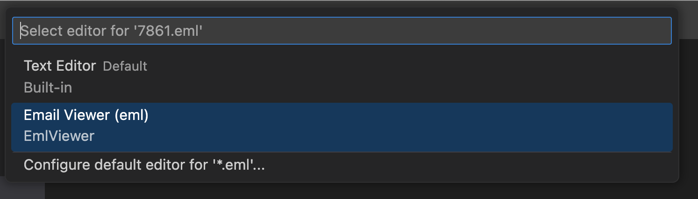

# Email viewer

Email viewer is a VS Code extension that allows you to feel email content in VS Code, from html, raw body to exporting attachements.

## Features

Features include:
* Seeing Subject, senders etc

You can open any .eml file with this new editor:

> Tip: Many popular extensions utilize animations. This is an excellent way to show off your extension! We recommend short, focused animations that are easy to follow.

## Extension Settings

This extension currently does't add any VS Code settings.

<!-- Include if your extension adds any VS Code settings through the `contributes.configuration` extension point.

For example:

This extension contributes the following settings:

* `myExtension.enable`: Enable/disable this extension.
* `myExtension.thing`: Set to `blah` to do something. -->

## Known Issues

This extension UI leaves some thing to be desired but otherwise there are no known issues.

## Release Notes

### 0.0.1

Initial release of the Email viewer.

* See HTML and Text bodies
* See Subject and from and to mails.
* See attachements and export them.

### Future

* Switch between view modes with Editor action: https://code.visualstudio.com/api/ux-guidelines/editor-actions
* Improve UI especially for attachements
* Make all information visible (all email headers)

