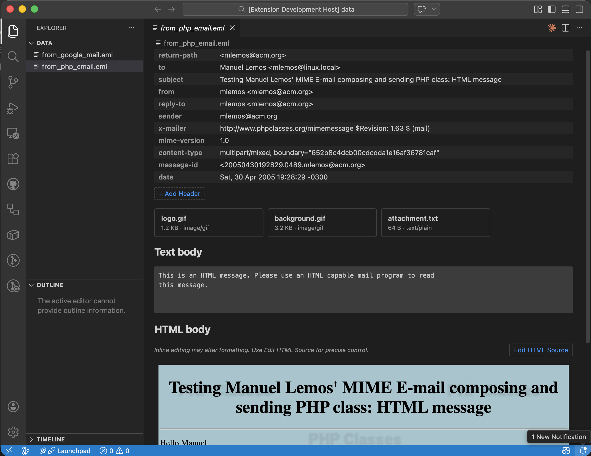
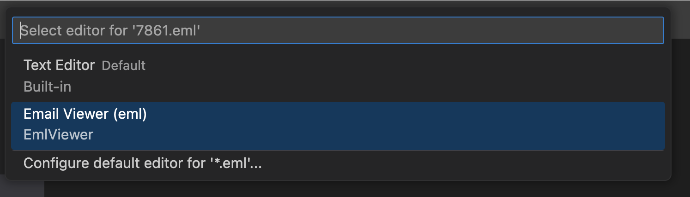

# Email Viewer for VS Code

View and edit `.eml` email files directly in VS Code — headers, HTML body, text body, and attachments — all in a single structured editor.



## What are `.eml` files?

`.eml` is the standard format for email messages ([RFC 5322](https://datatracker.ietf.org/doc/html/rfc5322)). Every email client can export and import them. They contain the full email: headers, body (plain text and/or HTML), inline images, and file attachments — all encoded in a single text file using MIME.

Common uses for `.eml` files:

- **Email templates** — design and version-control email templates alongside your code
- **Testing** — inspect and modify test fixture emails for email-processing pipelines
- **Archiving** — browse saved email correspondence without an email client
- **Debugging** — examine raw email structure, headers, and encoding issues

## Features

- **Header editing** — view and edit all email headers inline, add new ones, or delete existing ones
- **HTML body preview** — rendered HTML preview with inline editing support; click "Edit HTML Source" for full control in a separate editor tab
- **Text body editing** — editable textarea for the plain text part, auto-creates one if missing
- **Attachments** — card-based layout showing filename, size, and MIME type; click to download
- **Theme support** — adapts to your VS Code theme (light, dark, high contrast)
- **Standards compliant** — preserves MIME structure, encodings, and boundaries on save

## Getting Started

1. Install the extension from the VS Code Marketplace
2. Open any `.eml` file — the Email Viewer opens automatically
3. Use **"Open With..."** to switch between the Email Viewer and the raw text editor



## Known Issues

No major known issues. If you find a bug, please [open an issue](https://github.com/joelharkes/vscode_email_viewer/issues).

## Contributing

Contributions are welcome! Here's how to get started:

```sh
git clone https://github.com/joelharkes/vscode_email_viewer.git
cd vscode_email_viewer
npm install
npm run compile
```

Press **F5** in VS Code to launch the Extension Development Host for testing.

```sh
npm run compile   # Build TypeScript
npm run lint      # Run ESLint
npm run test      # Run test suite
```

### Guidelines

- Use [conventional commits](https://www.conventionalcommits.org/) (`feat:`, `fix:`, `refactor:`)
- TypeScript strict mode
- Test with sample `.eml` files in the `data/` directory

## License

[MIT](LICENSE)
